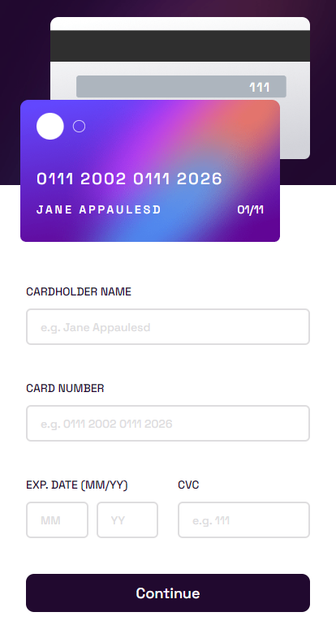

# Frontend Mentor - Interactive card details form solution

This is a solution to the [Interactive card details form challenge on Frontend Mentor](https://www.frontendmentor.io/challenges/interactive-card-details-form-XpS8cKZDWw). Frontend Mentor challenges help you improve your coding skills by building realistic projects.

## Table of contents

- [Overview](#overview)
  - [The challenge](#the-challenge)
  - [Screenshot](#screenshot)
  - [Links](#links)
- [My process](#my-process)
  - [Built with](#built-with)
  - [What I learned](#what-i-learned)
  - [Continued development](#continued-development)
  - [Useful resources](#useful-resources)
- [Author](#author)
- [Acknowledgments](#acknowledgments)

## Overview

This is a challenge to create credit card payement page fully responsive and functional.

### The challenge

Users should be able to:

- Fill in the form and see the card details update in real-time
- Receive error messages when the form is submitted if:
  - Any input field is empty
  - The card number, expiry date, or CVC fields are in the wrong format
- View the optimal layout depending on their device's screen size
- See hover, active, and focus states for interactive elements on the page

### Screenshot




### Links

- Solution URL: [Solution URl](https://github.com/iliassel19/creditCardPage)
- Live Site URL: [Live site](https://ilfara-khds.netlify.app/)

## My process

### Built with

- Semantic HTML5 markup
- CSS custom properties
- Flexbox
- Desktop-first workflow

### What I learned

I think this is the major thing that I learned in this project. How to check if a string contains a number to check the validity of the input information.
This is the code snippet that helped me figure out the solution for my problem.

```js
const containsNumber = function (str) {
  return /[0-9]/.test(str);
};
```

### Continued development

I think that I need more to sharpen my knowledge in css and also in commenting my js code.

### Useful resources

- [Cleave.js Library](https://nosir.github.io/cleave.js/) - This helped me to format input fields according to their function and purpose.
- [Ressource 2](https://bobbyhadz.com/blog/javascript-check-if-string-contains-numbers#:~:text=Use%20the%20RegExp.,otherwise%20false%20will%20be%20returned.) - This is an amazing article which helped me to figure out how to cheeck if a string contains numbers.

## Author

- Website - [Add your name here](https://www.your-site.com)
- Frontend Mentor - [@yourusername](https://www.frontendmentor.io/profile/yourusername)

## Acknowledgments

I would like to recommend this video of [codeSTACKr](https://www.youtube.com/watch?v=jEa9YyRqE1U). It's where I got exposed for the first time to cleave.js library, this latter was a major discovery for the shortcut, because it saved a lot of time to format input field manualy with hard coding.
